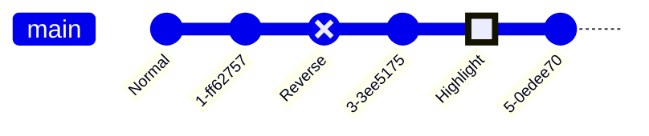

# Mermaid Diagram examples

## Using mermaid

### Basic mermaid2 test diagram

  
## Styling

### Test of adding hyperlinks

This may or may not work.

### Flow chart

### Sequence diagram

### Class diagram

### State Diagram

### Gantt chart

### Pie chart

### ER diagram

### User Journey

### Pie chart

### ER diagram

### Second User Journey

## Gitgraph (experimental)

